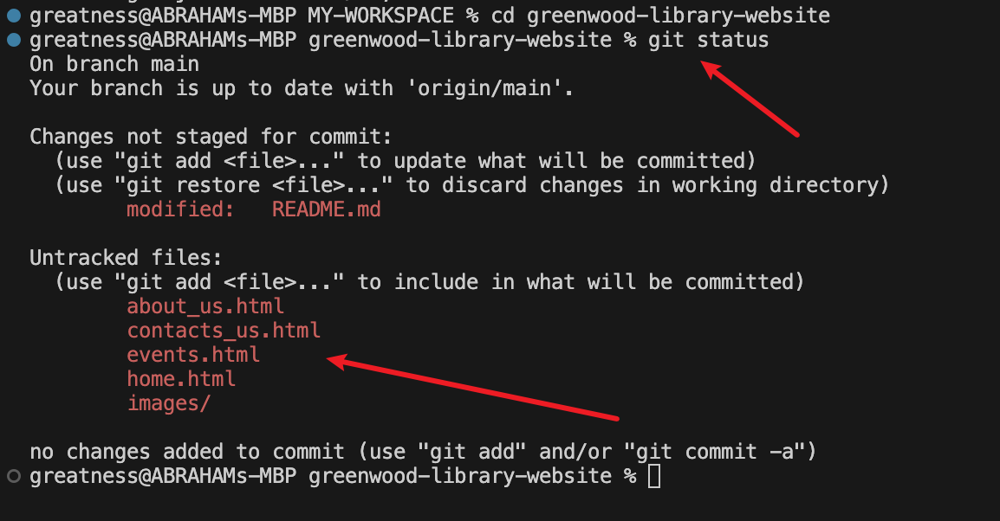
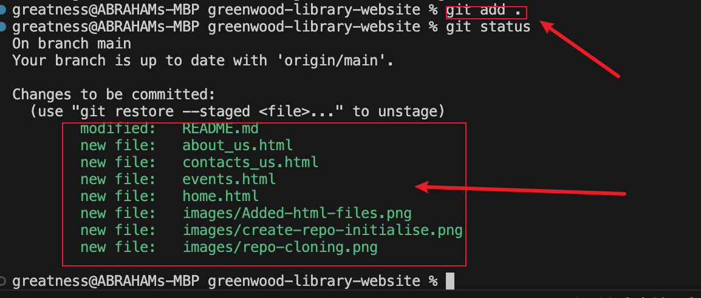
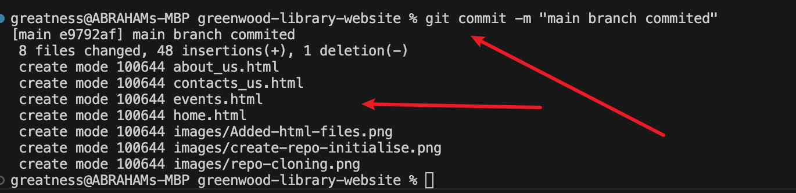
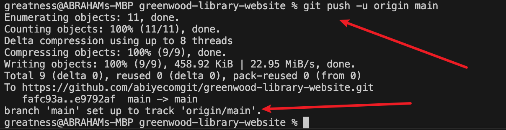
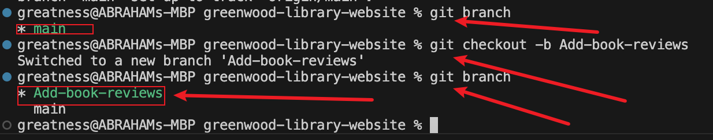

# greenwood-library-website

# Git-CapStone-Project: Enhancing a Community Library Website

**Background Scenario**

I'm part of a development team tasked with enhancing the website for the "**Greenwood Community Library**." 
The website aims to be more engaging and informative for its visitors. It currently includes basic sections: 
Home, About Us, Events, and Contact Us. Your team decides to add a "Book Reviews" section and update the "Events" 
page to feature upcoming community events.
I will simulate the roles of two contributors: "**Morgan**" and "**Jamie**". Morgan will focus on adding the "Book 
Reviews" section, while Jamie will update the "Events" page with new community events.

## Objectives

* Practice cloning a repository and working with branches in Git.

* Gain experience in staging, committing, and pushing changes from both developers.

* Create pull requests and merge them after resolving any potential conflicts.

## Setup

1. Create a Repository on GitHub:
Name it website-greenwood-library
Initialize it with a README.md file and clone it to your local machine.

## Tasks

1. In the main branch, using Visual Studio Code editor ensure there are files for each of the web pages.

* home.html

* about_us.html

* events.html

* contact_us.html

2. Add any random content into each of the files.

3. Stage, commit and push the changes directly to the main branch. (This is a simulation of the team's existing code base for the website)

The following commands were used to stage, commit and push:

`git add . `

`git commit -m "main branch commited"`

`git push -u origin main`

**Morgan's Work: Adding Book Reviews**

1. From the main branch I Created a Branch for Morgan: 
Add-book-reviews

2. I Switch to a new branch named add-book-reviews. 

Below command was used:

git branch

git checkout -b Add-book-reviews

